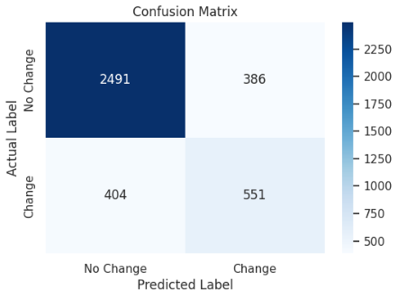
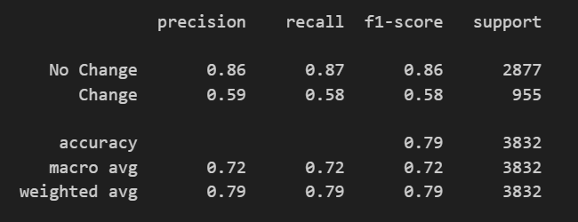
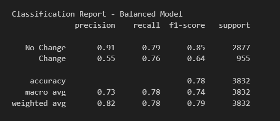
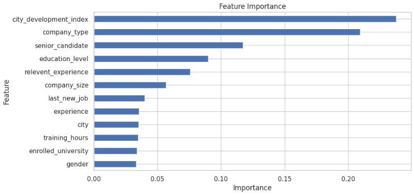

# Job Change Prediction using Machine Learning
End-to-end machine learning pipeline built on AWS to predict candidate job change behavior using demographic and professional data.


## Table of Contents
- [Project Highlights](#project-highlights)
- [Project Overview](#project-overview)
- [Objective](#objective)
- [Dataset Source](#dataset-source)
- [Dataset](#dataset)
- [Project Structure](#project-structure)
- [Tech Stack](#tech-stack)
- [Project Architecture](#project-architecture)
- [Architecture Diagram](#architecture-diagram)
- [Data Preprocessing](#data-preprocessing)
- [Data Quality Validation](#data-quality-validation)
- [How to Run](#how-to-run)
- [Handling Class Imbalance](#handling-class-imbalance)
- [Machine Learning Model](#machine-learning-model)
- [Evaluation Metrics](#evaluation-metrics)
- [Model Results](#model-results)
- [Feature Importance](#feature-importance)
- [Business Impact](#business-impact)
- [Assumptions and Limitations](#assumptions-and-limitations)
- [Future Improvements](#future-improvements)

## Project Highlights

- Built an end-to-end ETL pipeline and machine learning model to predict candidate job change behavior.
- Transformed raw CSV datasets into optimized Parquet files for analytical workloads.
- Implemented data validation checks to ensure dataset consistency.
- Performed feature engineering and handled class imbalance to improve model performance.
- Trained and tuned machine learning models to optimize predictive accuracy.
- Evaluated model performance and visualized key metrics and feature importance.

## Project Overview

This project develops a machine learning model to predict whether a candidate is likely to change jobs based on demographic, educational, and professional attributes.

The workflow includes data preprocessing, feature engineering, handling class imbalance, model training, hyperparameter tuning, and performance evaluation to build a reliable predictive model.

## Objective
The objective of this project is to predict whether a candidate is likely to change jobs, helping companies optimize training investments and improve workforce planning.

## Dataset Source
This project uses the **HR Analytics: Job Change of Data Scientists dataset**, a public dataset commonly used for analytics and machine learning projects.

- **Source:** [Kaggle - Job Change of Data Scientists](https://www.kaggle.com/datasets/arashnic/hr-analytics-job-change-of-data-scientists)
- **Usage:** Educational and portfolio purposes only

> **Note:** This dataset is a sample of historical candidate data and does not represent full production data.

## Dataset
The dataset contains information about candidates who signed up for company training programs. 

Key features include:

- *enrollee_id* – Unique candidate ID  
- *city* – City code  
- *city_development_index* – Scaled development index of the city  
- *gender* – Candidate gender  
- *relevent_experience* – Whether candidate has relevant experience  
- *enrolled_university* – Type of university course enrolled  
- *education_level* – Level of education  
- *major_discipline* – Major discipline of study  
- *experience* – Total years of experience  
- *company_size* – Number of employees at current employer  
- *company_type* – Type of current employer  
- *last_new_job* – Years since previous job  
- *training_hours* – Training hours completed  
- _target_ – 0: Not looking for job change, 1: Looking for job change

**Note:** The dataset is imbalanced and contains missing values.

## Project Structure
```
job_change_ml
│
├── data/
│ ├── raw/
│ ├── processed/
│ └── cleaned/
│
├── glue_jobs/
├── notebooks/
└── screenshots/
```

## Tech Stack
- **Python** – Data processing and machine learning pipeline development  
- **Amazon S3** – Cloud data storage  
- **AWS Glue** – Data cleaning and preprocessing  
- **AWS SageMaker** – Model development and training environment  
- **Pandas / NumPy** – Data manipulation and feature engineering  
- **Scikit-learn** – Data preprocessing, model evaluation, and metrics  
- **XGBoost** – Gradient boosting algorithm for classification  
- **Matplotlib / Seaborn** – Data visualization and exploratory analysis  
- **Parquet** – Columnar storage format optimized for analytics  

## Project Architecture

Raw CSV → S3 → Glue Job → Parquet Storage → SageMaker 

## Architecture Diagram
        
        Raw Data (CSV files)
            │
            ▼
        Amazon S3 (Storage)
            │
            ▼
        AWS Glue Jobs
    (Data Cleaning + Feature Engineering)
            │
            ▼
        Amazon S3 (Parquet)
            │
            ▼
        AWS SageMaker
    Model Training (XGBoost)
            │
            ▼
        Model Evaluation


## Data Preprocessing
Steps performed in the project:

1. Extracted raw candidate data from CSV files.
2. Selected analytical features relevant for job change prediction.
3. Handled missing values using appropriate imputations (categorical and numerical).
4. Cleaned and standardized columns with special values such as *experience* and *last_new_job*.
5. Encoded categorical variables using label encoding.
6. Generated additional features such as *senior_candidate* based on experience levels.
7. Exported curated outputs in Parquet format using AWS Glue.


## Data Quality Validation

During the transformation stage, several validation checks were applied:

- Ensured that critical fields do not contain null values.
- Validated data types for selected features.
- Standardized and handled special categorical values such as ">20" and "never".
- Verified consistency of engineered features such as *senior_candidate*.

## How to Run

1. Download the Job Change of Data Scientists dataset from Kaggle.
2. Upload the raw CSV files to the appropriate folders in your Amazon S3 bucket.
3. Run the AWS Glue jobs to clean and preprocess the datasets.
4. Store the curated output in Parquet format.
5. Load the processed dataset into Amazon SageMaker.
6. Perform feature engineering and handle class imbalance.
7. Train and evaluate machine learning models.
8. Generate visualizations to analyze model performance.

## Handling Class Imbalance

The dataset is imbalanced, with a significantly higher number of candidates not looking for job changes.

To address this issue, the **scale_pos_weight** parameter was applied in the XGBoost model to balance the positive class during training and improve recall for minority class predictions.

## Machine Learning Model

**Model:** XGBoost Classifier  

An **XGBoost classifier** was selected due to its strong performance on tabular datasets and ability to handle non-linear relationships between features.

### Hyperparameter Tuning

Two models were trained to evaluate performance improvements:


**Model #1**
n_estimators=200,
max_depth=6,
learning_rate=0.1

**Model #2***
n_estimators=200,
max_depth=6,
learning_rate=0.1,
scale_pos_weight=scale

## Evaluation Metrics
- Accuracy
- Confusion Matrix
- Precision
- Recall
- F1-score

## Model Results
### Model 1

| Confusion Matrix | Evaluation Metrics |
|-------------|-------------|
|  |    |

### Model 2

| Confusion Matrix | Evaluation Metrics |
|-------------|-------------|
|  |   |
  
The second model improves recall for the positive class, identifying a higher proportion of candidates likely to change jobs.

This trade-off slightly reduces precision but results in better detection of high-risk candidates, which is more valuable for business scenarios such as talent retention and recruitment planning.

## Feature Importance

Feature importance analysis was performed to identify the most influential variables in predicting whether a candidate is likely to change jobs.



The model is primarily driven by a small number of highly influential features:

- **city_development_index (~24%)** – This remains the most influential variable, suggesting that local economic and development conditions strongly affect job change behavior.
- **company_type (~21%)** – The type of company continues to play a major role, likely reflecting differences in work environment, benefits, stability, and career opportunities.
- **senior_candidate (~12%)** – Seniority now appears as one of the strongest predictors, indicating that more experienced candidates may follow different job-change patterns.

Together, these three features account for more than half of the model’s predictive importance.

Other relevant variables include:

- **education_level (~9%)** – Educational background contributes meaningfully to the prediction.
- **relevent_experience (~8%)** – Previous relevant experience also helps explain job mobility.
- **company_size (~5%)** – Organizational size has a moderate influence on whether a candidate is likely to switch jobs.

The remaining features, such as **last_new_job**, **experience**, **city**, **training_hours**, **enrolled_university**, and **gender**, have comparatively smaller contributions.

Overall, the results suggest that job change behavior is influenced more by external and professional-context factors—such as city development, company characteristics, and seniority—than by demographic variables alone.

## Business Impact

- **Talent retention:** Predicting job change probability helps organizations identify high-risk employees and implement retention strategies before attrition occurs.

- **Training optimization:** Companies can prioritize training investments on candidates with lower likelihood of leaving, maximizing return on investment.

- **Recruitment strategy:** Identifying candidates more likely to change jobs enables recruiters to target individuals who are actively open to new opportunities.

- **Workforce planning:** Insights from job change patterns support better long-term workforce planning and reduce unexpected turnover.

- **Cost reduction:** Reducing employee churn helps minimize costs associated with hiring, onboarding, and training new employees.

## Key Insights
- The model shows strong performance in identifying candidates not likely to change jobs, but requires optimization to better detect high-risk candidates.

- Improving recall for the positive class significantly increases the model’s ability to identify candidates likely to change jobs, which is critical for retention strategies.

- Feature importance analysis indicates that **city_development_index** is the strongest predictor, followed by **company_type** and **senior_candidate**. This suggests that external conditions and professional context have a greater influence on job change behavior than personal attributes alone.

- Class imbalance has a significant impact on model performance, requiring techniques such as weighted training to improve minority class detection.

## Assumptions and Limitations
- This dataset is a public sample and does not represent full production HR data.
- The analysis is based on historical candidate data and should be interpreted as exploratory.
- The model assumes that historical patterns are indicative of future job change behavior.
- Class imbalance may affect model performance, particularly in predicting minority class outcomes.
- Business insights are inferred from model predictions and feature relationships, not from real organizational data or financial metrics.

## Future Improvements
- Improve model performance using advanced techniques such as hyperparameter optimization and ensemble methods.
- Implement additional feature engineering to capture more complex candidate behavior patterns.
- Apply advanced interpretability techniques such as SHAP values for deeper model insights.
- Deploy the model as an API for real-time predictions.
- Integrate the pipeline into a production environment with automated retraining workflows.