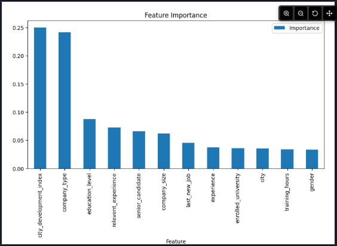
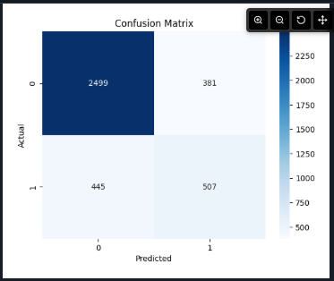
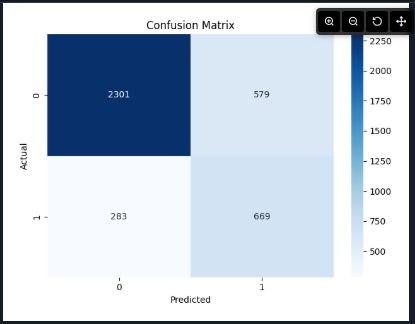
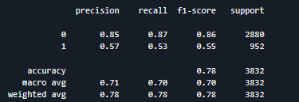
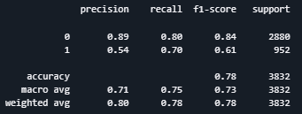

# Job Change Prediction using Machine Learning
End-to-end machine learning pipeline built on AWS to predict candidate job change behavior using demographic and professional data.


## Project Overview

This project builds a machine learning model to predict if a candidate is likely to change jobs using demographic, educational, and professional features.

The workflow includes data preprocessing, feature engineering, model training, and model evaluation.

## Objective
The objective of this project is to predict whether a candidate is likely to change jobs, helping companies optimize training investments and improve workforce planning.

## Dataset
The dataset contains information about candidates who signed up for company training programs. 

Key features include:

- *enrollee_id* – Unique candidate ID  
- *city* – City code  
- *city_development_index* – Scaled development index of the city  
- *gender* – Candidate gender  
- *relevent_experience* – Whether candidate has relevant experience  
- *enrolled_university* – Type of university course enrolled  
- *education_level* – Level of education  
- *major_discipline* – Major discipline of study  
- *experience* – Total years of experience  
- *company_size* – Number of employees at current employer  
- *company_type* – Type of current employer  
- *last_new_job* – Years since previous job  
- *training_hours* – Training hours completed  
- _target_ – 0: Not looking for job change, 1: Looking for job change

**Note:** The dataset is imbalanced and contains missing values.

## Project Structure
```
job_change_ml
│
├── data/
│ ├── raw/
│ ├── processed/
│ └── cleaned/
│
├── glue_jobs/
├── notebook/
└── screenshots/
```

## Tech Stack
- Python 
- Pandas / NumPy – Data manipulation  
- Amazon S3 - Storage 
- AWS Glue – Data cleaning and preprocessing 
- AWS SageMaker – Jupyter notebooks and model training  
- XGBoost – Machine learning algorithm  
- Scikit-learn – Data splitting and evaluation metrics  
- Matplotlib / Seaborn – Visualization

## Project Architecture

Raw CSV → S3 → Glue Job → Parquet Storage → SageMaker 

## Architecture Diagram
        
        Raw Data (CSV)
            │
            ▼
        Amazon S3 (Storage)
            │
            ▼
        AWS Glue Jobs
    Data Cleaning & Feature Engineering
            │
            ▼
        Clean Dataset (Parquet)
            │
            ▼
        AWS SageMaker
    Model Training (XGBoost)
            │
            ▼
        Model Evaluation


## Data Preprocessing
Steps performed in the project:

1. Missing values were imputed (Unknown or numeric replacements).  
2. Categorical features were converted to numeric using label encoding.  
3. Columns like *experience* and *last_new_job* were cleaned to handle special values like >20 or never.  
4. Derived feature *senior_candidate* added (experience ≥10 years).  
5. Data was saved in clean Parquet format using AWS Glue.

## Data Quality Validation
- Validation of non-null values for critical fields
- Verification of correct data types
- Handling of special categorical values (">20", "never")
- Consistency checks for engineered features

## Handling Class Imbalance

The dataset is imbalanced, with significantly more candidates not looking for job changes.

To address this issue, the parameter **scale_pos_weight** was used in the XGBoost model to balance the positive class during training.

## Machine Learning Model

**Model:** XGBoost Classifier  

An **XGBoost classifier** was selected due to its strong performance on tabular datasets and ability to handle non-linear relationships between features.

**Hyperparameters:**

***First Model***
n_estimators=200,
max_depth=6,
learning_rate=0.1

***Second Model***
n_estimators=350,
max_depth=6,
learning_rate=0.07,
subsample=0.9,
colsample_bytree=0.8,
scale_pos_weight=scale

## Evaluation Metrics
- Accuracy
- Confusion Matrix
- Precision
- Recall
- F1-score

## Model Results
### First Model
                precision    recall  f1-score   support

           0       0.85      0.87      0.86      2880
           1       0.57      0.53      0.55       952

    accuracy                           0.78      3832
   macro avg       0.71      0.70      0.70      3832
weighted avg       0.78      0.78      0.78      3832

### Second Model
                precision    recall  f1-score   support

           0       0.89      0.80      0.84      2880
           1       0.54      0.70      0.61       952

    accuracy                           0.78      3832
   macro avg       0.71      0.75      0.73      3832
weighted avg       0.80      0.78      0.78      3832

The second model improves recall for the positive class, detecting 17% more candidates likely to change jobs.

## Business Impact

Predicting job change probability allows companies to:

- Identify candidates more likely to leave after training.
- Optimize training investment.
- Improve candidate targeting for recruitment.

## Visualizations
| Feature Importance |
|--------------------------------|
|  |

| Confusion Matrix (1 Model) | Confusion Matrix (2 Model) |
|-------------|-------------|
|  |  |

| Accuracy, Precision, Recall and F1-Score (1 Model) | Accuracy, Precision, Recall and F1-Score (2 Model) |
|--------------|--------------|
|  |  |